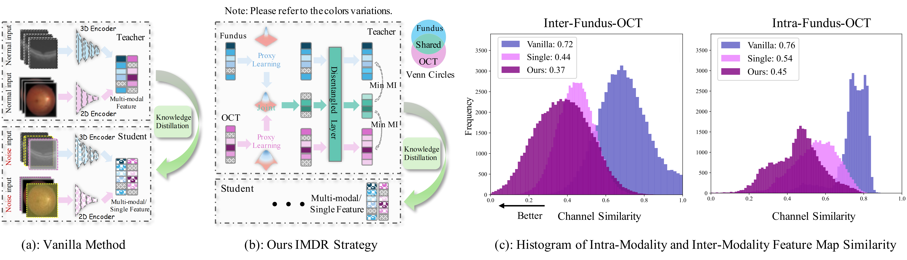
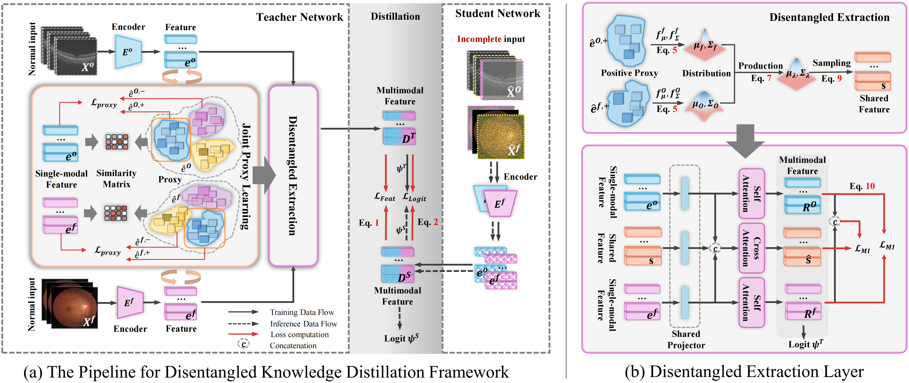

# Incomplete Modality Disentangled Representation for Ophthalmic Disease Grading and Diagnosis
[Chengzhi Liu*]()<sup style="color: #FFB6C1;">1</sup>, [Zile Huang*]()<sup style="color: #FFB6C1;">1</sup>, [Zhe Chen]()<sup style="color: #FFB6C1;">1</sup>,  [Feilong Tang†]()<sup style="color: #FFB6C1;">2</sup>, [Zhongxing Xu]()<sup style="color: #FFB6C1;">2</sup>,  [Yu Tian]()<sup style="color: #FFB6C1;">3</sup>, [Zhongxing Xu]()<sup style="color: #FFB6C1;">2</sup>, [Yalin Zheng]()<sup style="color: #FFB6C1;">1</sup>, [Yanda Meng†]()<sup style="color: #FFB6C1;">4</sup>

<sup style="color: #FFB6C1;">1</sup>University of Liverpool, <sup style="color: #FFB6C1;">2</sup>Monash University, <sup style="color: #FFB6C1;">3</sup>University of Pennsylvania, <sup style="color: #FFB6C1;">4</sup>University of Exeter


<sup style="color: #FFB6C1;">*</sup>Equal contribution

<a href=''></a> <a href='https://imdr-aaai.github.io/'></a>
</a>


## Abstract
Ophthalmologists typically require multimodal data sources
to improve diagnostic accuracy in clinical decisions. How-
ever, due to medical device shortages, low-quality data and
data privacy concerns, missing data modalities are common
in real-world scenarios. Existing deep learning methods tend
to address it by learning an implicit latent subspace represen-
tation for different modality combinations. We identify two
significant limitations of these methods: (1) implicit repre-
sentation constraints that hinder the model’s ability to cap-
ture modality-specific information and (2) modality hetero-
geneity, causing distribution gaps and redundancy in fea-
ture representations. To address these, we propose an Incom-
plete Modality Disentangled Representation (IMDR) strat-
egy, which disentangles features into explicit independent
modal-common and modal-specific features by guidance of
mutual information, distilling informative knowledge and en-
abling it to reconstruct valuable missing semantics and pro-
duce robust multimodal representations. Furthermore, we in-
troduce a joint proxy learning module that assists IMDR in
eliminating intra-modality redundancy by exploiting the ex-
tracted proxies from each class. Experiments on four ophthal-
mology multimodal datasets demonstrate that the proposed
IMDR outperforms the state-of-the-art methods significantly.


## 👨‍💻 Data Preparation


```
2D-Fundus & 3D OCT
├── AMD
│   ├── Train
│   │   ├── fundus.png
│   │   └── OCT_Slices
│   │       ├── slice_1.png
│   │       ├── slice_2.png
│   │       └── ...
│   ├── Test
│   │   ├── fundus.png
│   │   └── OCT_Slices
│   │       ├── slice_1.png
│   │       ├── slice_2.png
│   │       └── ...
├── DR ...
├── Glaucoma ... 
```


## Method



## Results


## Citation
```
@misc{liu2025incompletemodalitydisentangledrepresentation,
      title={Incomplete Modality Disentangled Representation for Ophthalmic Disease Grading and Diagnosis}, 
      author={Chengzhi Liu and Zile Huang and Zhe Chen and Feilong Tang and Yu Tian and Zhongxing Xu and Zihong Luo and Yalin Zheng and Yanda Meng},
      year={2025},
      eprint={2502.11724},
      archivePrefix={arXiv},
      primaryClass={cs.CV},
      url={https://arxiv.org/abs/2502.11724}, 
}
```

